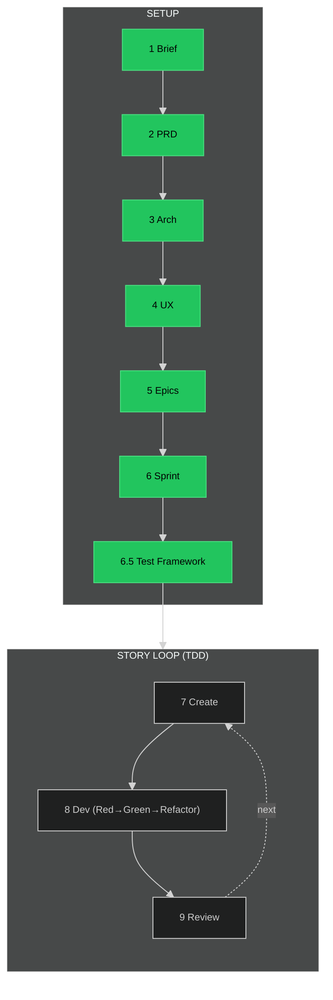

# BMAD Timeline

## Position: ✅ SETUP COMPLETE - Ready for TDD Story Loop

**Status:** All 7 setup steps complete (including test framework). 88 stories in sprint-status.yaml.
**Next:** Step 8 - Dev Story (`/bmad-dev-story`) with TDD workflow

---

---

## Status

| # | Step | Cmd | ✓ |
|---|------|-----|---|
| 1 | Brief | `/bmad-create-product-brief` | ● |
| 2 | PRD | `/bmad-create-prd` | ● |
| 3 | Arch | `/bmad-create-architecture` | ● |
| 4 | UX | `/bmad-create-ux-design` | ● |
| 5 | Epics | `/bmad-create-epics-and-stories` | ● |
| 6 | Sprint | `/bmad-sprint-planning` | ● |
| 6.5 | Test Framework | `/bmad-testarch-framework` | ● |
| 7 | Create | `/bmad-create-story` | ● |
| 8 | Dev (TDD) | `/bmad-dev-story` | ○ |
| 9 | Review | `/bmad-code-review` | ○ |

**Legend:** ▶ NOW · ● DONE · ○ TODO

### TDD Workflow (Step 8)

The Dev step follows **Red→Green→Refactor**:
1. **Red:** Write failing tests first
2. **Green:** Implement minimal code to pass
3. **Refactor:** Clean up while tests stay green
4. **Self-validate:** Run full test suite before declaring done

---

*Oscar enforces this sequence*
