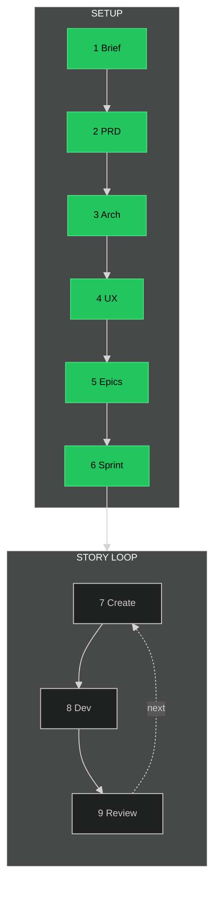

# BMAD Timeline

## Position: ✅ SETUP COMPLETE - Ready for Story Loop

**Status:** All 6 setup steps complete. 88 stories in sprint-status.yaml.
**Next:** Step 7 - Create Story (`/bmad-create-story`)

---

---

## Status

| # | Step | Cmd | ✓ |
|---|------|-----|---|
| 1 | Brief | `/bmad-create-product-brief` | ● |
| 2 | PRD | `/bmad-create-prd` | ● |
| 3 | Arch | `/bmad-create-architecture` | ● |
| 4 | UX | `/bmad-create-ux-design` | ● |
| 5 | Epics | `/bmad-create-epics-and-stories` | ● |
| 6 | Sprint | `/bmad-sprint-planning` | ● |
| 7 | Create | `/bmad-create-story` | ○ |
| 8 | Dev | `/bmad-dev-story` | ○ |
| 9 | Review | `/bmad-code-review` | ○ |

**Legend:** ▶ NOW · ● DONE · ○ TODO

---

*Oscar enforces this sequence*
